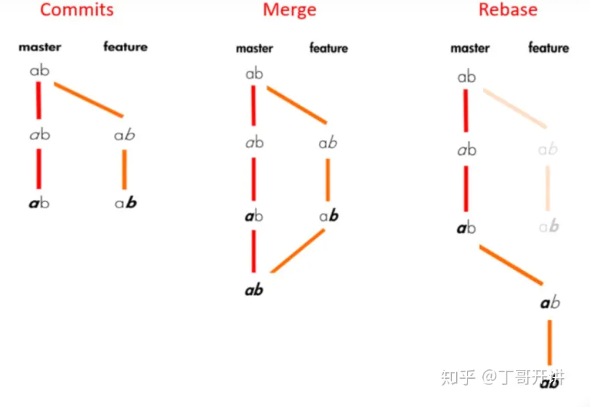

# git-doc

## rebase 和 merge 的区别

rebase 更加适用于在自己的分支上开发时其他分支有更新，需要同步到自己的分支上的情况，这样可以避免分支之间的交错，让提交历史更加清晰。

commit更加适合于开发完了一个feature，需要合并到主分支上的情况，能够保留所有的提交历史，让回滚和纠错变得更加容易。

由此可以推出导言问题的答案，每个同学自己开一个分支，最后提pr合并到一起，在进行修改的时候同学修改完在本地解决冲突后推到master，新的任务可以开一个dev分支，每个小内容从dev分支上开一个分支，在写的过程中如果master/dev分支有更新，可以通过rebase的方式传递变化，最后merge。

## cherry-pick

cherry-pick 可以将某个分支上的某个 commit 合并到当前分支上，但是会产生一个新的 commit，这个 commit 的 hash 值和原来的不一样，但是内容是一样的。

- 好像需要完整的commit hash，什么时候学学docker

## git stash

~~~shell
git stash save "message"
git stash list
git stash apply stash@{0}
git stash drop stash@{0}
~~~

or

~~~shell
git stash pop
~~~

- apply不会删除stash，pop会删除stash

## submodule

~~~shell
git submodule add <submodule_url>
~~~

clone主仓库不会把submodule的内容clone下来，需要执行

~~~shell
git submodule init
git submodule update
~~~

or

~~~shell
git clone <main_repo_url> --recursive-submodules
~~~
