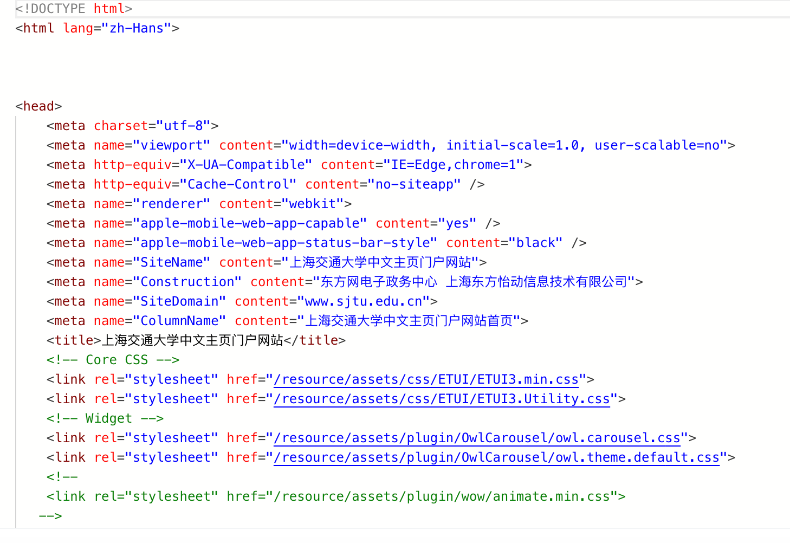
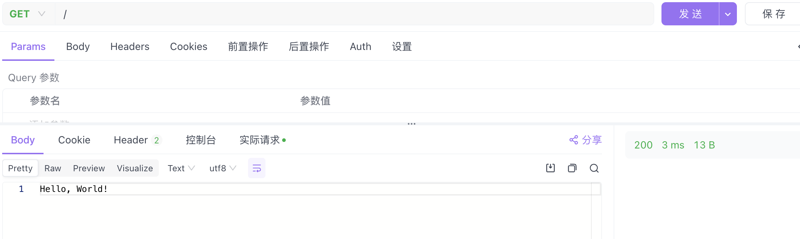
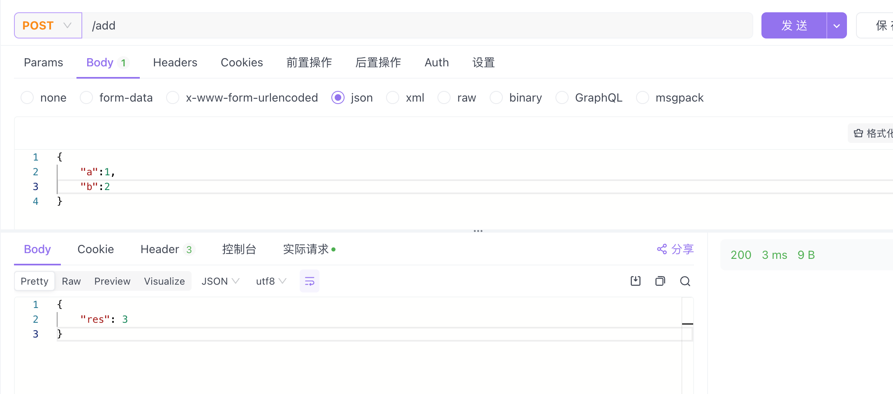
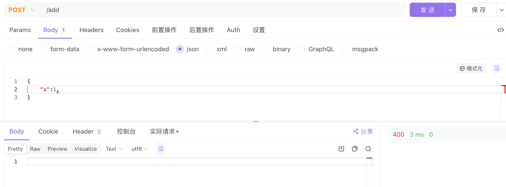

# web-doc

## http

对sjtu.edu.cn发送GET请求后得到的response如图




header中包含了响应的状态码，状态码为200，表示请求成功，同时还有各种metadata，如时间、内容格式、编码格式、修改时间等。body中包含了响应的内容，为html文档。


## rust-server




错误处理：


*handler如下*

```rust
 let json_config = web::JsonConfig::default()
            .limit(4096)
            .error_handler(|err, _req| {
                // create custom error response
                error::InternalError::from_response(err, HttpResponse::BadRequest().finish()).into()
            });

```
